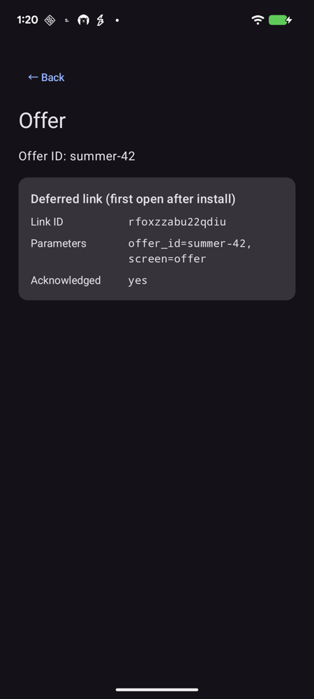
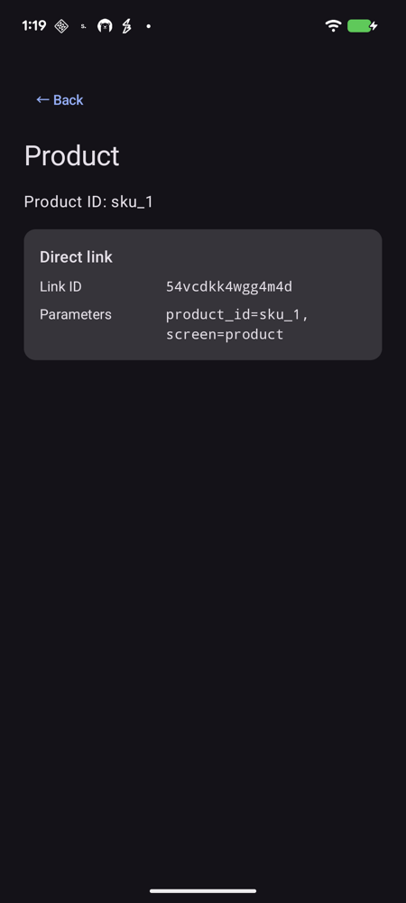

# Run the sample template

A complete integration you can run and copy from.

| Deferred link (first open after install) | Direct link (app installed) |
|---|---|
|  |  |

### Run it

1. Use **your own app's `applicationId` (installed package)**. This sample is
   a template to adapt to your app. Use that package's App ID and client key,
   and register the certificate that signs your installed build
   (`./gradlew signingReport`). Play installs use the Play app-signing certificate.
   There is no shared demo app, shared key, or sample registration on the server.
   Register these events for your own app:

   | Event | Counted | Parameters |
   |---|---|---|
   | `sign_up` | once per installation | `method: string` |
   | `tutorial_complete` | once per installation | — |
   | `level_complete` | every event | `level: number`, `score: number`, `perfect: bool` |
   | `purchase` | every event | `sku: string`, `revenue: number`, `currency: string`, `order_id: string` |

2. Add your values to `local.properties` (git-ignored):

   ```properties
   attrack.packageName=com.yourcompany.yourapp
   attrack.appId=app_xxxxxxxxxxxxxxxxxxxxxxxx
   attrack.clientKey=your-client-key
   ```

   They also work as `-P` Gradle flags or as the environment variables
   `ATTRACK_PACKAGE_NAME`, `ATTRACK_APP_ID` and `ATTRACK_CLIENT_KEY`.
   A package name is required before building.

3. The template already configures the Nexus Maven repository and the
   `com.adforus.sdk:attrack:1.0.2` dependency. Keep the repository URL as configured.
   Gradle downloads the SDK and its dependencies when you sync or build. Set `attrack.packageName` to your exact registered package.
   The source `namespace` and `kr.co.attrack.sample` folders describe the template's
   code; the installed package is set by `attrack.packageName`.
   Gradle automatically expands `${applicationId}` in `AndroidManifest.xml`.

4. Build and install:

   ```bash
   ./gradlew :app:installDebug
   ```

Without an App ID or client key the app still runs and shows why the SDK did not
start (`INVALID_APP_ID` or `INVALID_CONFIGURATION`).

### What it shows

| Screen | Shows |
|---|---|
| **Overview** | `Tracker.status()`, the start result, the event schema and `Tracker.installAttribution()` |
| **Events** | One button per event, plus deliberate mistakes the SDK rejects on the device |
| **Links** | Recent link results, and a retry button when the link service was unreachable |
| **Offer / Product** | The page a link opens, with how you arrived: direct or deferred, link ID, parameters, acknowledgement |
| **Data** | The device identifiers the SDK collects |
| **Log** | Every SDK result, newest first (also in logcat: `adb logcat -s AttrackSample`) |

### Where the integration lives

| File | What it shows |
|---|---|
| [`SampleApplication.kt`](../app/src/main/java/kr/co/attrack/sample/SampleApplication.kt) | Result listener, then `initializeWithResult` once in `Application.onCreate` |
| [`SampleEvents.kt`](../app/src/main/java/kr/co/attrack/sample/SampleEvents.kt) | `logEventWithResult` for each event |
| [`MainActivity.kt`](../app/src/main/java/kr/co/attrack/sample/MainActivity.kt) | `handleDeepLink` in `onCreate`/`onNewIntent`, acknowledging deferred links, `handoffId`, retry on the next foreground |
| [`DeepLinkRouter.kt`](../app/src/main/java/kr/co/attrack/sample/DeepLinkRouter.kt) | Allow-listed routing of link parameters (unit-tested) |
| [`AndroidManifest.xml`](../app/src/main/AndroidManifest.xml) | Application registration and a link filter scoped to your applicationId |

### Try a link

```bash
APP_PACKAGE="com.yourcompany.yourapp"  # your registered applicationId
LINK_ID="YOUR_LINK_ID"
adb shell am start -W -a android.intent.action.VIEW \
  -d "https://api.attrack.co.kr/l/$APP_PACKAGE/$LINK_ID"
```

Use a link ID created for your own registered app. Deferred links need an install from Google
Play (for example an internal testing track); a sideloaded APK reports `NO_LINK`.
